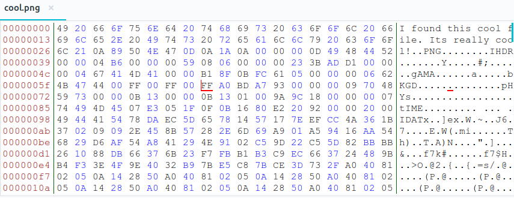

# Cool Image 2
**Category:** forensic  
**Point:** 102

> Written by: cppio
> 
> My friend sent me this image, but I can't open it. Can you help me open the image?

file : [cool.png](https://ctf.hsctf.com/files/428259fb8dbdd5b42cc45b52bddf7989/cool.png?token=eyJ0ZWFtX2lkIjoxODMyLCJ1c2VyX2lkIjoyODY3LCJmaWxlX2lkIjo3fQ.XRTspA.NcYa-8Zu7hUM4aSTFlhZT6XovPY)

---

Kita diberikan sebuah file berekstensi `.png`, ketika kita buka menggunakan image viewer tidak bisa karena terdapat error. Disini selanjutnya kita lakukan _hex editing_ untuk dapat melihat apa yang sebenarnya terjadi. Saya menggunakan tools `bless`, untuk menginstalnya cukup menggunakan `sudo apt install bless`.

Dari hasil _dumping_ diatas, terdapat kejanggalan, yaitu hex-hex awal yang seharusnya diisi dengan magic header namun diisi dengan sebuah kalimat. Sesuai dengan _file signature_, file PNG diawali dengan hex **`89 50 4E 47 0D 0A 1A 0A`**. Silahkan baca mengenai file signature/magic header [disini](https://www.garykessler.net/library/file_sigs.html).

Selanjutnya, kita perlu menghapus hex sebelum `89 50 4E 47 0D 0A 1A 0A` dengan menggunakan bless kemudian simpan hasil perubahannya dengan nama yang berbeda, saya menyimpan dengan nama `output.png`. Terakhir kita buka menggunakan image viewer dan gotcha!! kita dapatkan flag yang dicari.

flag : `hsctf{sorry_about_the_extra_bytes}`