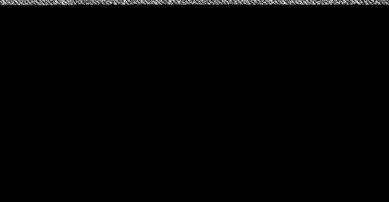

# Logo Sucks Bad
**Category:** forensic <br>
**Point:** 140

> Written by: Tux
> 
> This logo sucks bad.

file : [logo.png](https://ctf.hsctf.com/files/38ad30013afe02d405f55e83e33e95a8/logo.png?token=eyJ0ZWFtX2lkIjoxODMyLCJ1c2VyX2lkIjoyODY3LCJmaWxlX2lkIjoxM30.XRT21Q.Z9qfXQBQNVRT-WXWHdFu6vhnq-M)

---


Untuk menyelesaikan challenge ini perlu beberapa waktu untuk menyadari. Sudah menggunakan beberapa teknik forensik kemudian baru sadar ketika menggunakan `Stegsolve`. Pada filter **Red plane 0**, **Green plane 0**, dan **Blue plane 0** terdapat kejanggalan yaitu kerusakan spektrum warna pada bagian atas gambar, hal ini bisa disebabkan karena penyembunyian data dengan menggunakan metode LSB (Least Significant Bit). Dan saya baru sadar bahwa sebenarnya judul challenge sudah memberikan clue yaitu **Logo Sucks Bad** atau disingkat **LSB**. Untuk penjelasan mengenai LSB pada steganografi silahkan baca pada referensi yang sudah saya sertakan di bagian bawah.



Untuk melakukan _decoding_ LSB gambar saya menggunakan tools yang sudah dibuat oleh [Chris](https://github.com/stylesuxx) yaitu [Steganography Online](https://stylesuxx.github.io/steganography/). Setelah dilakukan _decoding_  berikut hasil yang didapat:

```
Lorem ipsum dolor sit amet, consectetur adipiscing elit. Duis non velit rutrum, porttitor est a, porttitor nisi. Aliquam placerat nibh ut diam faucibus, ut auctor felis sodales. Suspendisse egestas tempus libero, efficitur finibus orci congue sit amet. Sed accumsan mi sit amet porttitor pellentesque. Morbi et porta lacus. Nulla ligula justo, pulvinar imperdiet porta quis, accumsan et massa. In viverra varius eleifend. Ut congue feugiat leo a ultrices.

Ut risus ipsum, dictum id euismod nec, mattis eu dolor. In aliquam viverra congue. Mauris lacinia lectus quis erat porttitor, vitae iaculis mauris ultrices. Donec quis imperdiet mi, et fermentum purus. Mauris rhoncus sit amet ex quis gravida. In tempor, libero vel finibus tristique, velit est vestibulum est, non semper leo mauris vel enim. Nulla non orci pharetra, bibendum quam a, pharetra felis. Morbi tincidunt, mauris nec aliquam maximus, eros justo rutrum odio, in dapibus sem arcu blandit nunc. Mauris dapibus sem lorem, quis lacinia nunc consectetur pulvinar. Donec sapien erat, pulvinar non fermentum tempor, auctor pellentesque tortor.

Suspendisse id vehicula enim. Cras ut enim sollicitudin, aliquam mauris eget, vehicula arcu. Morbi convallis sed nulla et pellentesque. Cras risus justo, fermentum eget ex ac, dictum dignissim magna. Nullam nec velit vel nulla varius gravida. Aliquam ac lorem tempor, venenatis nibh sed, ultricies urna. In fringilla hendrerit purus, tristique aliquam ipsum molestie vitae. Sed efficitur auctor lacus ac luctus.

Donec id viverra augue. Vivamus nullhsctf{th4_l3est_s3gnific3nt_bbbbbbbbbbbbb}a neque, iaculis quis urna eget, gravida commodo quam. Vestibulum porttitor justo in suscipit rutrum. Sed id tristique ipsum. Nulla vel porta nisl. Quisque leo quam, placerat id neque eu, ullamcorper facilisis lacus. Maecenas magna eros, sollicitudin id est a, fermentum elementum leo. Vestibulum porttitor urna eget bibendum interdum. Mauris eget consequat est. Aenean hendrerit eleifend finibus. Sed eu luctus nulla, non tristique nunc. Cras aliquet vehicula tincidunt. Maecenas nec semper ipsum.

Proin pulvinar lacus id malesuada bibendum. Mauris ac sapien eros. Sed non neque id ante porta finibus eget eget enim. Pellentesque placerat, neque sit amet dictum eleifend, tortor dolor porttitor ex, in vestibulum lacus tortor id purus. Phasellus varius nulla sed magna finibus aliquet. Proin eros metus, sodales vel enim eu, imperdiet pulvinar erat. Nunc quis iaculis dui. In cursus a urna in dapibus. Sed eu elementum quam. Vivamus ornare convallis leo sed mollis. Aenean sit amet nulla vel leo cursus dictum ac nec sem. Morbi nec ultrices felis.
```

Pada hasil diatas terdapat flag yang kita cari.

flag : `hsctf{th4_l3est_s3gnific3nt_bbbbbbbbbbbbb}`

## Referensi
* STEGANOGRAFI DENGAN LEAST SIGNIFICANT BIT (LSB) (https://mti.binus.ac.id/2017/06/08/steganografi-dengan-least-significant-bit-lsb/)
* TEKNIK STEGANOGRAPHY DENGAN METODE LEAST SIGNIFICANT BIT (LSB) (https://www.researchgate.net/publication/308610177_TEKNIK_STEGANOGRAPHY_DENGAN_METODE_LEAST_SIGNIFICANT_BIT_LSB)