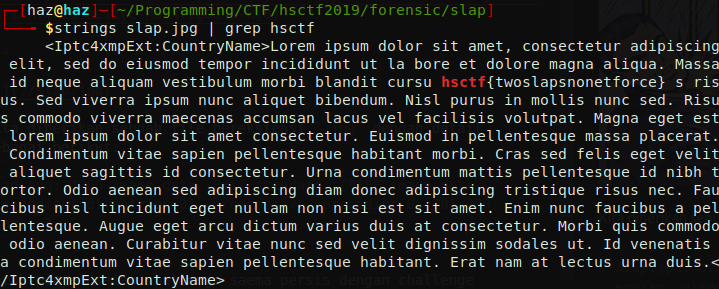

# Slap
**Category:** forensic <br>
**Point:** 103

> Written by: Shray Vats, Jasper
> 
> Don't get slapped too hard.

file : [slap.jpg](https://ctf.hsctf.com/files/bc9448c733afe7071a8327a461d4defa/slap.jpg?token=eyJ0ZWFtX2lkIjoxODMyLCJ1c2VyX2lkIjoyODY3LCJmaWxlX2lkIjo2Nn0.XRT1AA.jkE2_aC1iyc-M5fXTigOd4s-kj0)

---


Kita diberikan sebuah file berekstensi `.jpg` dengan detail sebagai berikut:
```
slap.jpg: JPEG image data, Exif standard: [TIFF image data, big-endian, direntries=0], progressive, precision 8, 285x200, frames 3
```

Untuk penyelesaian challenge saema persis dengan challenge [Chicken Crossing](./../chicken_crossing) yaitu dengan melihat string yang ada pada file binary `slap.jpg`

```bash
strings slap.jpg | grep hsctf
```



flag : `hsctf{twoslapsnonetforce}`