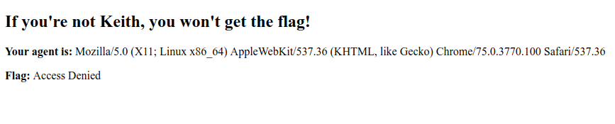
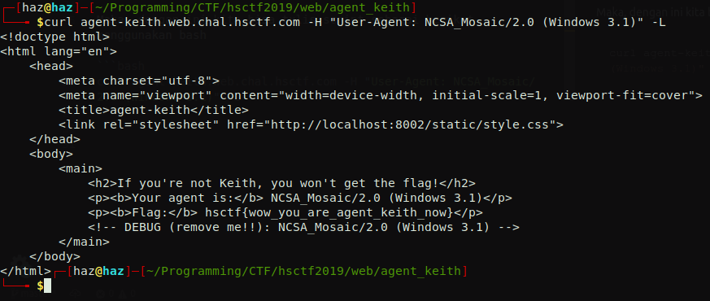

# Agent Keith
**Category:** web <br>
**Point:** 101

> Written by: dwang
> 
> Keith was looking at some old browsers and made a site to hold his flag.
> 
> https://agent-keith.web.chal.hsctf.com

---



Pada website yang diarahkan hanya menampilkan pesan user agent yang dipakai dan terdapat 1 blok yang menampilkan bahwa akses flag ditolak.

Challenge ini cukup simple, karena dengan menampilkan pesan **user agent** kita tahu bahwa kita perlu mengganti header request `User-Agent` dengan yang diinginkan. Baca mengenai User Agent [disini](https://developer.mozilla.org/en-US/docs/Web/HTTP/Headers/User-Agent).

Dengan melihat source, kita mendapatkan 1 baris yang kemungkinan besar adalah _user agent_ yang perlu dipakai. 

```
<!-- DEBUG (remove me!!): NCSA_Mosaic/2.0 (Windows 3.1) -->
```

Maka, dengan ini kita bisa tulis script sebagai berikut menggunakan bash

```bash
curl agent-keith.web.chal.hsctf.com -H "User-Agent: NCSA_Mosaic/2.0 (Windows 3.1)" -L
```



flag : `hsctf{wow_you_are_agent_keith_now}`