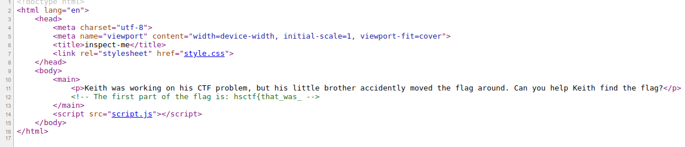
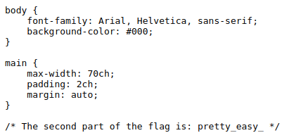
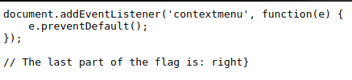

# Inspect Me
**Category:** web  
**Point:** 51

> Written by: dwang
> 
> Keith's little brother messed up some things...
> 
> https://inspect-me.web.chal.hsctf.com
> 
> Note: There are 3 parts to the flag!

---

Pada website yang diarahkan tidak menampilkan apa-apa, maka dari itu kita coba lihat _source_ website nya (CTRL+U).

Pada halaman index kita berhasil mendapatkan potongan pertama flag, namun kita perlu mendapatkan 2 potongan lainnya agar dapat membentuk flag yang diinginkan.

Selanjutnya kita telusuri apa yang ada di dalam external css dan script, yaitu file `style.css` dan `script.js`.

Setelah mendapatkan semua potongan flag, maka kita gabungkan agar menjadi flag yang utuh.

flag : `hsctf{that_was_pretty_easy_right}`