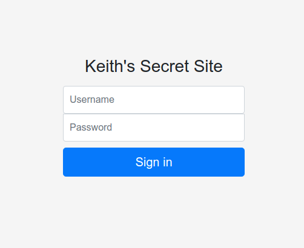

# S-Q-L
**Category:** web <br>
**Point:** 101

> Written by: dwang
> 
> Keith keeps trying to keep his flag safe. This time, he used a database and some PHP.
> 
> https://s-q-l.web.chal.hsctf.com/

---



Pada challenge ini kita diberikan sebuah form dengan 2 input yaitu username dan password. Challenge tipe seperti ini adalah challenge yang umum dan sangat sering pada CTF, yaitu dengan melakukan SQL Injection umum. Baca tentang [SQL Injection](https://ctf101.org/web-exploitation/sql-injection/what-is-sql-injection/).

**Payload**
```
username = 'or'1'='1
password = 'or'1'='1
```

Setelah dicoba, input yang tidak difilter adalah pada bagian password, sehingga _injection_ hanya berlaku pada password.

flag : `hsctf{mysql_real_escape_string}`